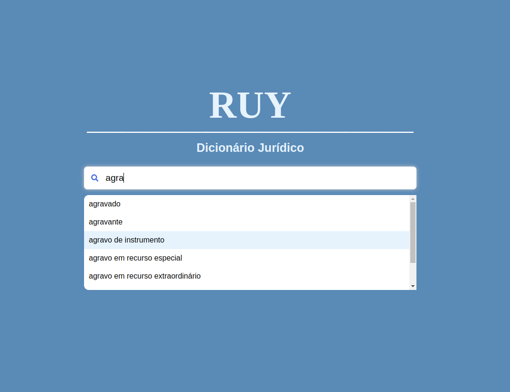

# Ruy

An autocomplete search bar that returns legal terms.

## How to Run with Docker

### Prerequisites

- [Docker](https://docs.docker.com/get-docker/)
- [Docker Compose](https://docs.docker.com/compose/install/)

### Steps

1. Install Docker and Docker Compose if they are not already installed.
2. Open your terminal.
3. Navigate to the root directory of the project.
4. Run the following command to build and start the project:
5. Inside frontend directory, run:
   
   ```sh
   npm install
   
6. Inside graphql-server directory, run:
   
   ```sh
   npm install
   
7. now, back to root directory, do:

    ```sh
   docker-compose up --build

#### This Project will be running on localhost:5173 like this:




